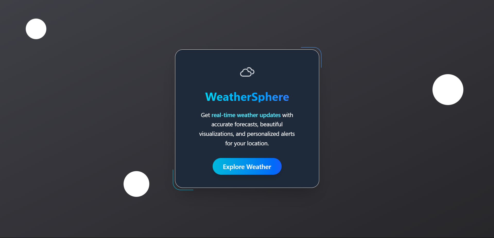
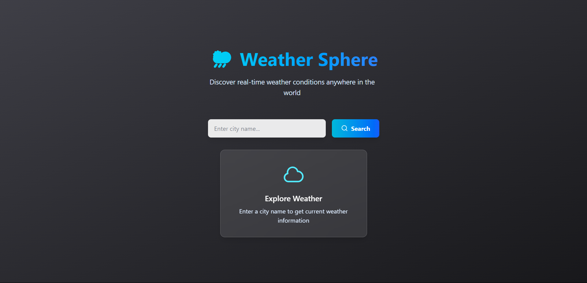
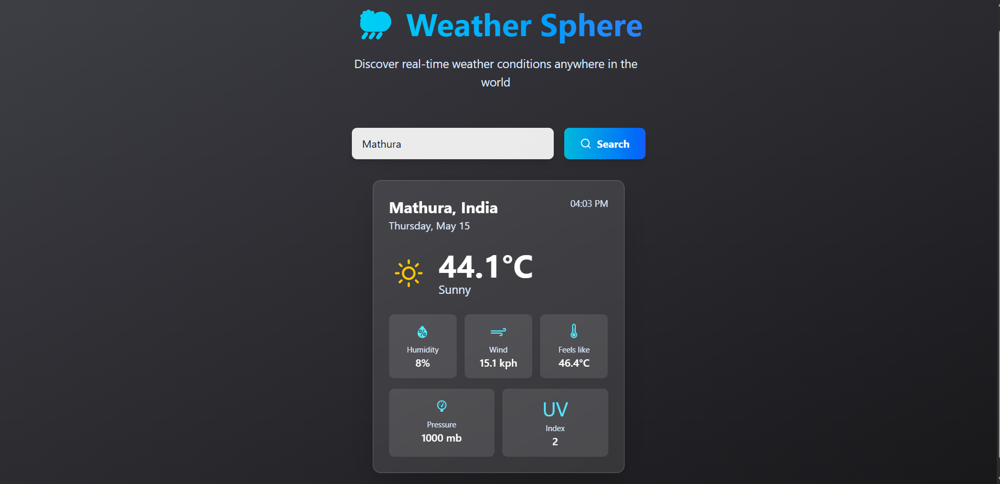

# 🌦 Weather Sphere

**Weather Sphere** is a responsive, user-friendly weather application that delivers **real-time weather updates**. Built using **React** and **Tailwind CSS**, it integrates the **WeatherAPI** to fetch live weather data based on user input.

🔗 Live Demo: https://weather-sphere-amber.vercel.app/


---

## 🚀 Features

- 🔍 **City-based Search**: Enter any city to get instant weather data
- 🌐 **Real-Time Weather**: Powered by [WeatherAPI](https://www.weatherapi.com/) for accurate, up-to-date conditions
- 💡 **Clean UI/UX**: Built with Tailwind CSS for a beautiful, responsive, and accessible interface
- 📱 **Responsive Design**: Works seamlessly across desktop, tablet, and mobile devices
- 🎨 **Dynamic Styling**: Weather-based colors and design enhancements for better user experience
- ✨ **Animated Transitions**: Smooth animations for interactive feedback

---

## 🛠️ Tech Stack

- **Frontend**: React (with Vite for fast build & dev)
- **Styling**: Tailwind CSS
- **API**: WeatherAPI (`http://api.weatherapi.com/v1/current.json`)
- **Animations**: Tailwind transitions and optional Framer Motion

---

## 📷 Preview





---

## 📦 Getting Started

### 🔧 Prerequisites

- Node.js & npm installed
- WeatherAPI key (register at [WeatherAPI](https://www.weatherapi.com/))

### ⚙️ Installation

```bash
# Clone the repo
git clone https://github.com/Kapilgupta25/Weather-Sphere.git
cd weather-sphere

# Install dependencies
npm install

# Start the development server
npm run dev
